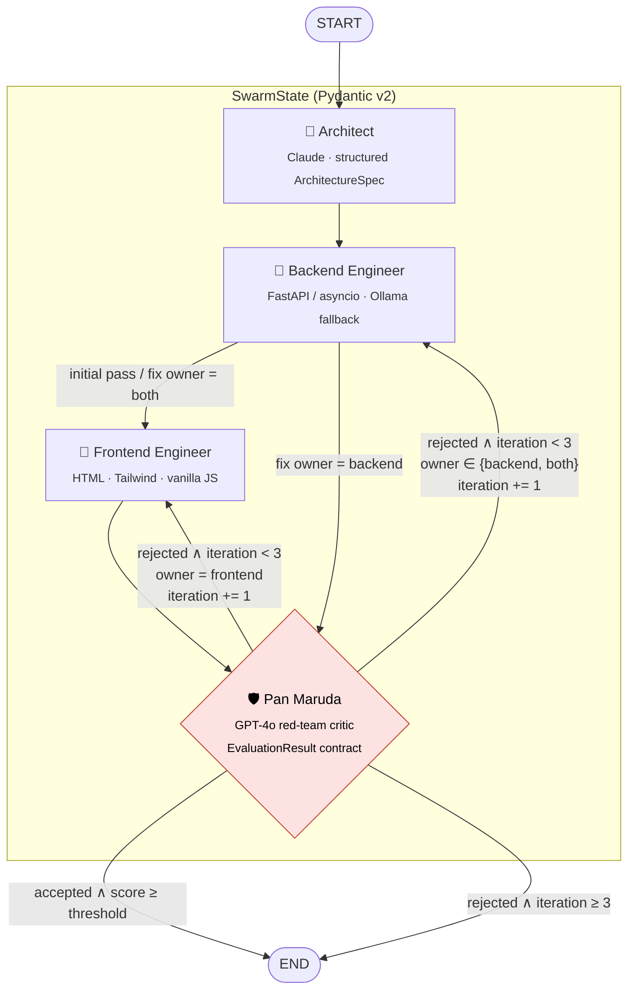

# swarm-showcase

A hierarchical multi-agent system that turns a product requirement into a **typed FastAPI
backend** and a **matching HTML/Tailwind frontend**. An adversarial critic from a *different
model family* reviews the output, and a deterministic self-correction loop sends its feedback
back to the engineer responsible for each problem.

Built on **LangGraph** (`StateGraph`), **Pydantic v2** contracts and **Langfuse** tracing.
It passes `ruff check`, `ruff format` and `mypy --strict`, and the test suite runs fully offline.

---

## Topology



| Node | Role | Default model | Output |
|---|---|---|---|
| `architect` | Breaks the requirement down into data models, endpoints and UI layout | `claude-opus-5-5` (Anthropic) | `ArchitectureSpec` → `architecture_spec` |
| `backend` | Writes one typed FastAPI module | `claude-sonnet-5`, falls back to `llama3.1:8b` via Ollama | `backend_code` |
| `frontend` | Writes one self-contained `index.html` that calls the backend | `claude-sonnet-5`, falls back to `llama3.1:8b` via Ollama | `frontend_code` |
| `critic` | Red-team review of both artifacts against the spec | `gpt-4o` (OpenAI or OpenRouter) | `CriticVerdict` → `eval_report` |

Every role's provider can be swapped independently: `anthropic`, `openai`, `openrouter` or `ollama`.

## Design decisions

- **Loop control is deterministic and lives in one place.** `CriticAgent.decide()` is a pure
  function. It (1) validates the LLM verdict against `EvaluationResult`, (2) applies a hard
  score gate: `is_accepted` is overridden to `False` when `score < SWARM_ACCEPTANCE_THRESHOLD`,
  and (3) increments `iteration` only when a revision is actually scheduled. The graph routers
  (`route_after_critic`, `route_after_backend`) only read `status` and `revision_target`, so
  you can test them without running a graph.
- **Feedback goes to the engineer who owns the problem.** `CriticVerdict` extends the strict
  `EvaluationResult` contract with `defect_owner`. A backend-only fix skips the frontend,
  which saves tokens and latency. A `both` fix re-runs the backend and then the frontend, so
  the UI tracks any API changes.
- **The critic uses an independent model family.** Code written by Claude is reviewed by
  GPT-4o, which reduces correlated blind spots.
- **Structured output is schema-native.** The architect and critic use
  `with_structured_output(..., method="json_schema")`. Both schemas are compatible with
  OpenAI strict mode (no free-form dicts, every field required).
- **Recursion is bounded.** `recursion_limit = 4 + 3 × max_iterations + 1`, derived from the
  worst-case path.
- **Credentials fail fast.** A missing key raises a clear error before any tokens are spent.
  The CLI returns exit code `2`.

## State schema

```python
class SwarmState(BaseModel):
    user_prompt: str
    architecture_spec: dict[str, Any]
    backend_code: str
    frontend_code: str
    eval_report: dict[str, Any]  # EvaluationResult + defect_owner + reviewed_iteration
    iteration: int  # number of revisions performed (0..max_iterations)
    status: str  # pending → … → accepted | max_iterations_reached
    revision_target: Literal["backend", "frontend", "both"] | None  # routing bookkeeping


class EvaluationResult(BaseModel):
    is_accepted: bool
    vulnerabilities: list[str]
    performance_notes: list[str]
    score: int  # 0..100, enforced with ge/le
```

## Project layout

```
src/
  config.py          pydantic-settings: role routing, loop limits, credentials
  state.py           SwarmState + ArchitectureSpec / EvaluationResult / CriticVerdict
  graph.py           StateGraph wiring + pure routing functions
  main.py            CLI entrypoint, Langfuse wiring, artifact export
  agents/
    base.py          AgentNode protocol, code-fence extraction, prompt helpers
    llm.py           provider factory (Anthropic / OpenAI / OpenRouter / Ollama + fallback)
    architect.py     Node 1
    backend.py       Node 2
    frontend.py      Node 3
    critic.py        Node 4: "Pan Maruda" + loop-control policy
tests/
  test_graph.py      23 offline tests: routers, retry caps, transitions, feedback propagation
```

## Quick start

Requirements: macOS/Linux, [`uv`](https://docs.astral.sh/uv/) and [`direnv`](https://direnv.net/).

```bash
cp .env.example .env          # add ANTHROPIC_API_KEY, OPENAI_API_KEY, optional LANGFUSE_*
direnv allow                  # activates .venv and pins every cache to the project dir
uv sync --frozen              # reproducible install from uv.lock

uv run --frozen python -m src.main                       # default task: rate-limited URL shortener
uv run --frozen python -m src.main --prompt "Build a token-bucket microservice ..."
```

The CLI writes the artifacts to `output/`: `spec.json`, `backend.py`, `index.html` and
`eval_report.json`.

To try them:

```bash
uv run --frozen --with fastapi --with uvicorn uvicorn output.backend:app --port 8000
open output/index.html
```

Exit codes: `0` accepted · `1` not accepted within the iteration budget · `2` configuration error.

### Fully local run (no cloud keys for the engineers)

```bash
ollama pull llama3.1:8b
SWARM_BACKEND__PROVIDER=ollama SWARM_BACKEND__MODEL=llama3.1:8b \
SWARM_FRONTEND__PROVIDER=ollama SWARM_FRONTEND__MODEL=llama3.1:8b \
uv run --frozen python -m src.main
```

With `SWARM_OLLAMA_FALLBACK_ENABLED=true` (the default), an engineer role also falls back to
Ollama at runtime when its primary provider errors, or when that provider's key is missing.

## Observability (Langfuse)

Tracing turns on automatically when `LANGFUSE_PUBLIC_KEY` and `LANGFUSE_SECRET_KEY` are set.

- Uses `langfuse.langchain.CallbackHandler`, the Langfuse v3+/v4 location of the handler
  formerly at `langfuse.callback.CallbackHandler`.
- A single trace, `swarm-showcase`, per run. It is grouped under a session id, set with
  `--session-id` or generated.
- Each graph node shows up as a span (`architect`, `backend`, `frontend`, `critic`) with nested
  generations (`architect.spec`, `backend.implement`, …). Each generation carries **token usage**
  and **latency**, and revision passes appear as repeated node spans.
- End-to-end wall-clock latency is also logged by the CLI. Traces are flushed before the process
  exits.

## Configuration reference

| Variable | Default | Purpose |
|---|---|---|
| `SWARM_<ROLE>__PROVIDER` | see table above | `anthropic` \| `openai` \| `openrouter` \| `ollama` |
| `SWARM_<ROLE>__MODEL` | see table above | model id for the role (`ARCHITECT`, `BACKEND`, `FRONTEND`, `CRITIC`) |
| `SWARM_MAX_ITERATIONS` | `3` | self-correction budget |
| `SWARM_ACCEPTANCE_THRESHOLD` | `80` | minimum critic score for acceptance |
| `SWARM_OLLAMA_FALLBACK_ENABLED` | `true` | runtime fallback for engineer nodes |
| `SWARM_OLLAMA_FALLBACK_MODEL` | `llama3.1:8b` | fallback model |
| `ANTHROPIC_API_KEY` / `OPENAI_API_KEY` / `OPENROUTER_API_KEY` | – | provider credentials |
| `LANGFUSE_PUBLIC_KEY` / `LANGFUSE_SECRET_KEY` / `LANGFUSE_BASE_URL` | – | tracing |

## Quality gates

```bash
uv run --frozen ruff format --check .
uv run --frozen ruff check .
uv run --frozen mypy            # strict, pydantic plugin, src + tests
uv run --frozen pytest -q       # offline, no API calls
```

The tests exercise the real graph and do not call any external API:

- **Routers.** Every combination of `status` × `revision_target`.
- **Critic policy.** Acceptance, the score-gate override, iteration increment, the stop at the
  limit, and output that satisfies the contract.
- **Transitions.** The exact node order on the happy path, backend-only, frontend-only and
  `both` fixes, and recovery on the last allowed iteration.
- **Retry threshold.** A critic that always rejects produces exactly 3 revisions and 4 reviews,
  then `END`.
- **Feedback propagation.** The real agent classes run against fake LangChain runnables, and
  the tests assert that the critic's vulnerabilities appear in the backend's revision prompt.

## Storage hygiene (external-SSD isolation)

All state stays under the project root on the external volume. `.envrc` pins
`UV_PROJECT_ENVIRONMENT`, `UV_CACHE_DIR` (with `UV_LINK_MODE=copy` for a cross-volume cache),
`HF_HOME`, `HUGGINGFACE_HUB_CACHE`, `TORCH_HOME` and `XDG_CACHE_HOME`, and sets
`PYTHONDONTWRITEBYTECODE=1`. It also pins the ruff, mypy, pytest and tiktoken caches and
`TMPDIR` to `./.cache/`.

`layout uv` is defined inline in `.envrc`, because some direnv releases don't ship it and a
global `direnvrc` would live on the internal disk. The only exception is `direnv allow`, which
records an approval hash in direnv's own data directory.
